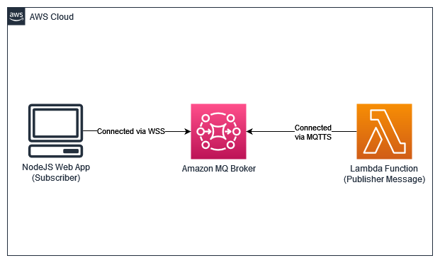

# MQTT — Simple Pub/Sub using Lambda

#### Tables of Contents:

- [Overview](#overview)
- [Project Structure](#project-structure)
- [Requirements](#requirements)
- [Setup Infrastructure](#setup-infrastructure)
- [Setup Lambda Publisher](#setup-lambda-publisher)
- [Setup Web-App](#setup-web-app)

---

## Overview

Welcome to mini workshop about MQTT using AmazonMQ - Lambda Function - ReactJS! Please take a look the architecture below.

<p align="center">

</p>

In this mini workshop, you will learn both about publishing and subscribing messages using MQTT. You will also learn how to setup/deploy web-app and lambda function in AWS.

The content of this mini workshop may be updated and if you have questions or find issues in this mini workshop, please file them as an Issue.

## Project Structure

```md
mqtt-simple-pubsub/
├─ functions/
├─ web/
├─ .gitignore
├─ architecture.png
├─ LICENSE
├─ README.md
```

- [`functions/`](/functions/) contains lambda function code for publishing messages to MQTT.
- [`web/`](/web/) contains source code of web-app build with ReactJS. This web-app works as a subcriber and will displays the data sent by the publisher.
- [`architecture.png`](/architecture.png) is an overview of the resources to be deployed.
- [`README.md`](/README.md) contains guide for this mini workshop.

## Requirements

Before starting this mini workshop, the following runtime/tools must be met and configured properly.

- Active [AWS Account](https://aws.amazon.com/).
- [NodeJS](https://nodejs.org/en) `v16` or latest.
- [AWS CLI version 2](https://aws.amazon.com/cli/).
- (optional) OS based on Linux.
  > **Note** </br>
  > Build script for package lambda function code and it's dependecies require Linux/Unix shell to operate. If you are using an OS other than Linux and/or your device doesn't support Linux shell commands you can customize [this build script](/functions/build.sh) to make sure it runs properly.

### AWS Resources

Some of the services from AWS that are used in this mini workshop are as follows:

- [AWS Lambda](https://aws.amazon.com/lambda/)
- [Amazon VPC](https://aws.amazon.com/vpc/)
- [Amazon MQ](https://aws.amazon.com/amazon-mq/)
- [Amazon EC2](https://aws.amazon.com/ec2/)

---

## Setup Infrastructure

> **Note** </br>
> If the settings/configurations are not specified in this guide, you can leave them as default or you can specify the values with your own.

1. Select AWS region.

2. Create VPC with following specifications:

   - Has two or more subnets.
   - Has internet gateway attached/route to public subnets.
   - (optional) At least one NAT Gateways route to private subnets.
     > **💡 TIP** </br>
     > Use it when the resource(s) needed internet connection. Note that there is a charge for each NAT gateway.
   - DNS hostnames and DNS resolution must be enabled.

3. Create first security group with following rules:

   - Allow port 8162 from anywhere
   - Allow port 8883 from anywhere
   - Allow port 61619 from anywhere
   - Allow all traffic/port to anywhere

4. Create Amazon MQ broker with following spefications:

   - Broker engine: Apache Active MQ
   - Deployment mode: Single-instance broker
   - Storage type: Durability optimized
   - Broker instance type: `mq.t3.micro`
   - ActiveMQ access: Simple Authentication and Authorization
     > Fill username and password with your own. Make sure you store it somewhere else so you don't forget. Alternatively, you can store it in [AWS SSM parameter store](https://docs.aws.amazon.com/systems-manager/latest/userguide/systems-manager-parameter-store.html) or [AWS Secret Manager](https://docs.aws.amazon.com/secretsmanager/latest/userguide/intro.html).
   - Broker engine version: `5.17.3`
   - Access type: Public access
   - VPC and subnets: Select existing VPC and subnet(s)
     > Select VPC that you've created before.
   - Security groups: Select existing security groups
     > Select first security group that you've created before.

5. Create second security group with following rules:

   - Allow HTTP/HTTPS port from anywhere
   - (optional) Allow port 3000 from anywhere
   - (optional) Allow SSH port from your IP
   - Allow all traffic/port to anywhere

6. Create EC2 instance with following configurations:

   > For AMI, Instance Type and Storage doesn't have to be exactly the same. For example you can choose instance type that has more large or small than the recommended type.

   - OS/Amazon Machine Image (AMI): Ubuntu 22.04 LTS (Recommended)
   - Instance Type: `t4g.small` (Recommended)
   - VPC: Select VPC that you've created before.
   - Subnet: Select subnet that you've created before.
   - Auto-assign public IP: `true`
   - Security group: Select existing security group
     > Select second security group that you've created before.
   - Storage size: 10 GiB (Recommended)
   - Storage type: `gp3` (Recommended)

## Setup Lambda Publisher

> **Note** </br>
> If the settings/configurations are not specified in this guide, you can leave them as default or you can specify the values with your own.

1. Select the same AWS region as the [infrastructure](#setup-infrastructure) that has been deployed.
2. Create Lambda function with the following configurations:

   - Runtime: Node.js 18.x
   - Memory: 128 MB
   - Handler: `publisher.handler`
   - Enable VPC
     > Select VPC and subnet group that you've created before. For security group you can use default security group or you can create custom security group.

3. Configure Lambda enviroment variables:

   ```env
   MQ_HOST=<your-amazonmq-mqtt-endpoint>
   MQ_TOPIC=message
   MQ_USERNAME=<your-amazonmq-username>
   MQ_PASSWORD=<your-amazonmq-password>
   ```

   example:

   ```env
   MQ_HOST="mqtt+ssl:b-123abc-45d-67ef-890123abc.mq.ap-southeast-1.amazonaws.com:8883"
   MQ_TOPIC=message
   MQ_USERNAME=admin
   MQ_PASSWORD=admin1234567
   ```

4. Build and publish code

   - Navigate to [`functions/`](/functions/)

     ```bash
     cd functions/
     ```

   - Install required dependencies

     ```bash
     yarn install
     ```

     or

     ```bash
     npm install
     ```

   - Build your lambda function code and dependencies to zip

     ```bash
     yarn run build
     ```

     or

     ```bash
     npm run build
     ```

   - Publish your zip package to lambda using AWS CLI:

     ```bash
     aws lambda update-function-code \
       --function-name <your-lambda-function-name> \
       --zip-file fileb://function.zip
     ```

5. Test invoke function with the following event:

   ```json
   {
     "message": "hello from lambda!"
   }
   ```

   > **Note** </br>
   > Feel free to change the `message` value.

## Setup Web-App

> **Note** </br>
> If the settings/configurations are not specified in this guide, you can leave them as default or you can specify the values with your own.
